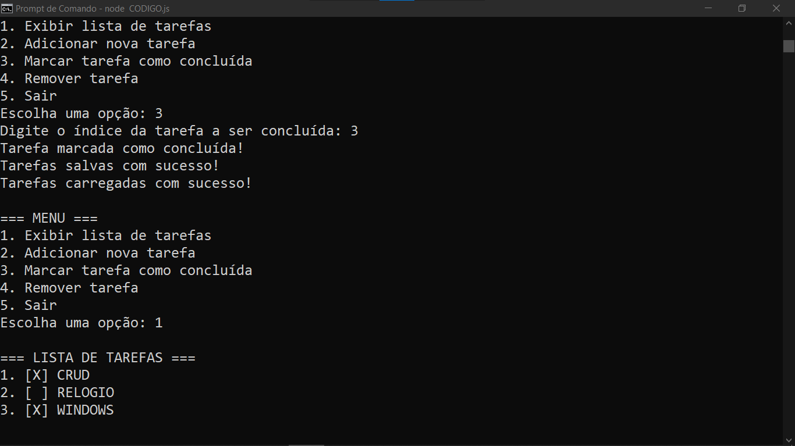

# CRUD DE TAREFAS
👨‍🏫CRUD DE GERENCIADOR DE TAREFAS COM TYPESCRIPT (NODEJS) E JSON.

 <br> <br> 

## DESCRIÇÃO:
Este é um aplicativo de lista de tarefas simples em linha de comando desenvolvido em TypeScript. Ele oferece uma maneira simples e interativa para os usuários gerenciarem suas tarefas, salvando e carregando os dados em um arquivo JSON para persistência entre diferentes execuções.

## RECURSOS:
1. **Leitura e escrita de arquivos**: O aplicativo utiliza o módulo `fs` do Node.js para carregar e salvar a lista de tarefas em um arquivo JSON chamado `TAREFAS.json`.

2. **Interface de Linha de Comando (CLI)**: A interface de linha de comando é implementada usando o módulo `readline` do Node.js. Ele exibe um menu de opções para o usuário e captura a entrada para realizar diferentes operações.

3. **Gerenciamento de Tarefas**: O aplicativo permite realizar as seguintes operações:
   - Exibir a lista de tarefas.
   - Adicionar uma nova tarefa à lista.
   - Marcar uma tarefa como concluída.
   - Remover uma tarefa da lista.
   - Sair do aplicativo.

4. **Funções Auxiliares**: O código inclui funções auxiliares para carregar tarefas do arquivo, exibir o menu, exibir a lista de tarefas, adicionar uma nova tarefa, marcar uma tarefa como concluída e remover uma tarefa.

5. **Main Function**: A função `main()` é responsável por iniciar o aplicativo. Ela carrega as tarefas, exibe o menu e inicia o ciclo de interação com o usuário. Dependendo da opção selecionada pelo usuário, a função chama outras funções para realizar as operações correspondentes.

## EXECUTANDO O PROJETO:
1. **Instalação das Dependências:**
    Certifique-se de que você tenha o Node.js instalado em seu sistema. Em seguida, navegue até o diretório onde o código-fonte do aplicativo está localizado e execute o seguinte comando para instalar as dependências:
    ```bash
    npm install 
    ```

2. **Executando o APP:**
    Agora execute o seguinte comando para compilar o TypeScript em JavaScript e iniciar o aplicativo:

  - Para usar o `NODE`, inicie o bot com o seguinte comando:
    ```bash
    npm start
    ```

    - Para usar o `NODEMON`, inicie o bot com o seguinte comando:
    ```bash
    npm test
    ```

3. **Interagindo com o Aplicativo**:
   Depois de iniciar o aplicativo, você verá um menu com as seguintes opções:

   ```
   === MENU ===
   1. Exibir lista de tarefas
   2. Adicionar nova tarefa
   3. Marcar tarefa como concluída
   4. Remover tarefa
   5. Sair
   ```

4. **Selecionando Opções**:
   - Para exibir a lista de tarefas, digite `1` e pressione Enter.
   - Para adicionar uma nova tarefa, digite `2`, pressione Enter e siga as instruções.
   - Para marcar uma tarefa como concluída, digite `3`, pressione Enter e siga as instruções.
   - Para remover uma tarefa, digite `4`, pressione Enter e siga as instruções.
   - Para sair do aplicativo, digite `5` e pressione Enter.

## NÃO SABE?
- Entendemos que para manipular arquivos com essas Tecnologias e linguagens relacionadas, é necessário possuir conhecimento nessas áreas. Para auxiliar nesse aprendizado, oferecemos cursos gratuitos disponíveis:
* [CURSO DE NODEJS](https://github.com/VILHALVA/CURSO-DE-NODEJS)
* [CURSO DE TYPESCRIPT](https://github.com/VILHALVA/CURSO-DE-TYPESCRIPT)
* [CURSO DE JSON](https://github.com/VILHALVA/CURSO-DE-JSON)
* [CONFIRA MAIS CURSOS](https://github.com/VILHALVA?tab=repositories&q=+topic:CURSO)

## CREDITOS:
- [PROJETO CRIADO PELO VILHALVA](https://github.com/VILHALVA)


